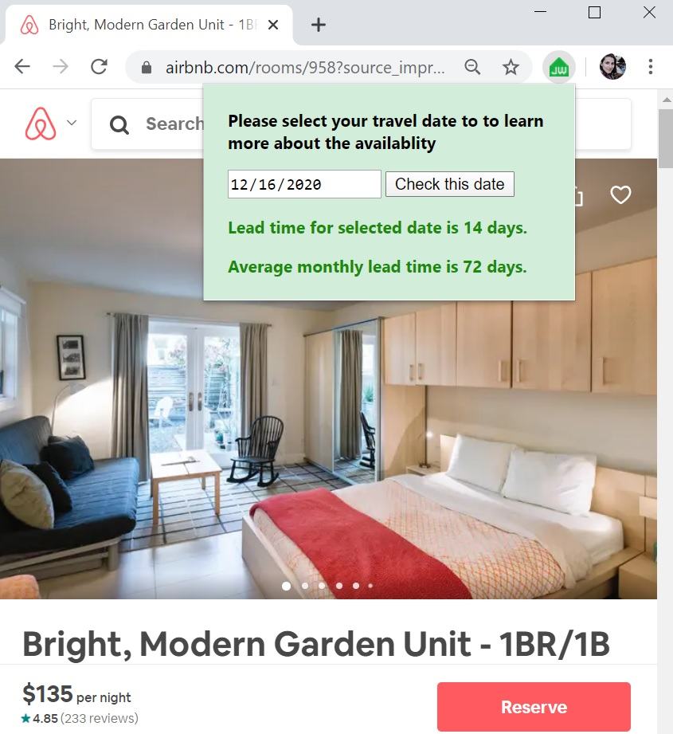

# JourneyWiser

This project builds a data pipeline to create a platform for predicting the booking lead time for a given airbnb listing and travel date. Booking lead time is a metric defined as the number of days between reservation date and check-in date. All the processed data is stored in Postgresql, queried in flask and visualized by a plug-in installed on chrome browser.
The lead time prediction is made by ingesting and analyzing 480 GB of historical data from airbnb collected for the past few years.

[link to slides](https://docs.google.com/presentation/d/1vo_jyTEAO1pe561yQhm0KKI3HU9puxuBQUplZ-Yy1w0/edit#slide=id.g6e15d5f2f7_0_126)

## Installation

## Pipeline Architecture
The raw data were uncompressed and uploaded to s3 in csv format. The data was then batch processed in spark and the processed data was fed to postgresql. Finally the data was visualized using flak and chrome plogin.

## Dataset
470GB data provided by [insideairbnb.com](http://insideairbnb.com/get-the-data.html).

## Engineering challenges

